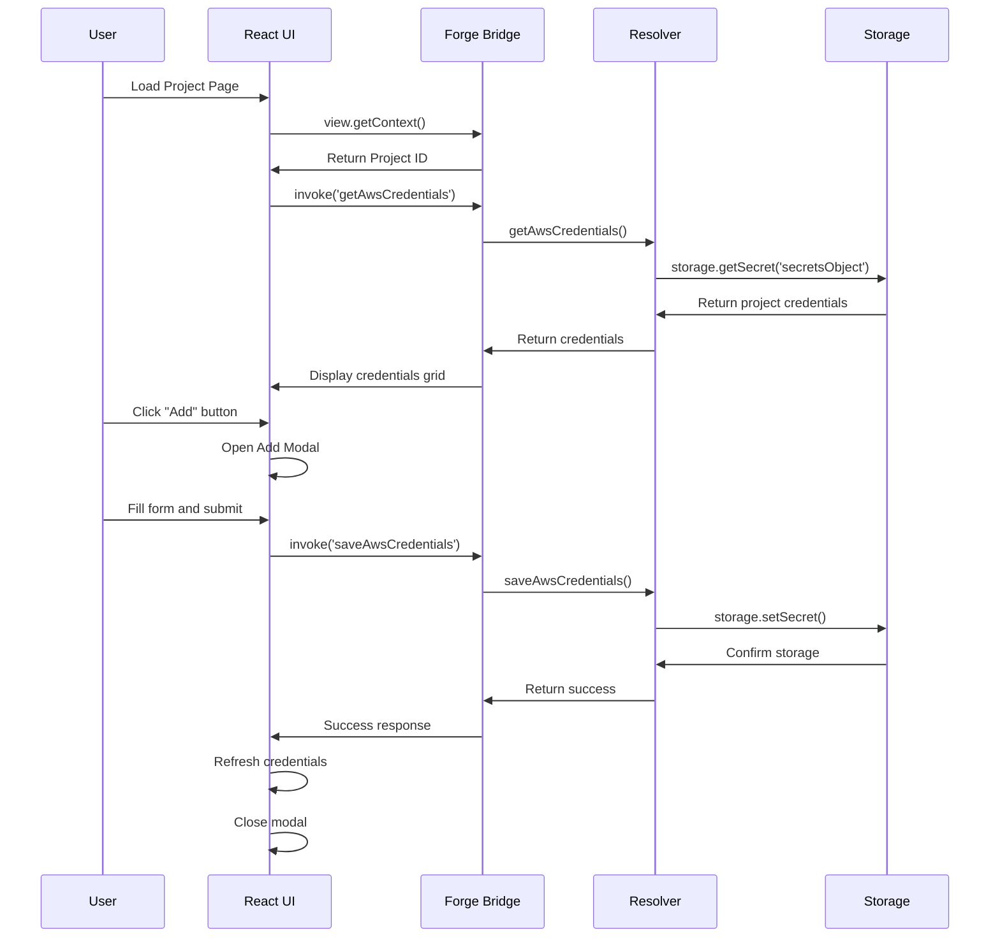
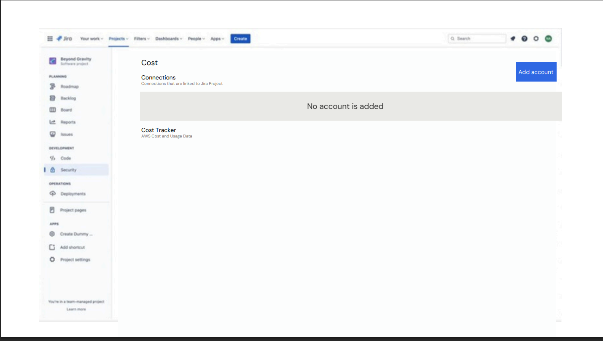
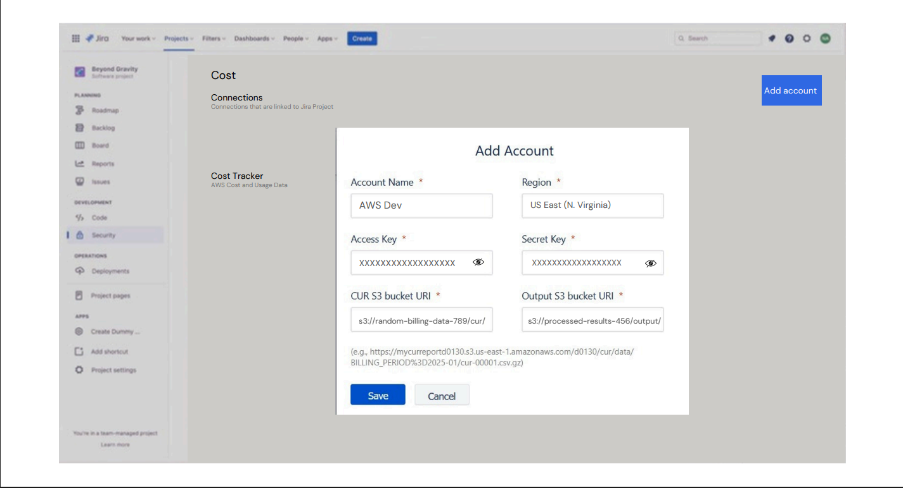
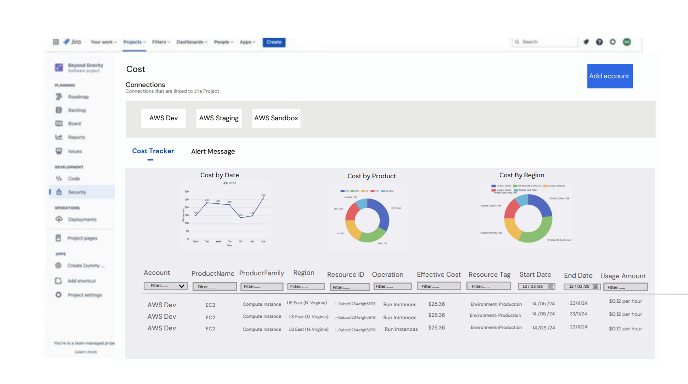

# AWS Cost Management Forge App

A comprehensive Atlassian Forge application for managing AWS Cost and Usage Report (CUR) credentials within Jira project pages. This app provides a secure interface for storing, editing, and managing AWS credentials for multiple accounts/targets per project.

## Table of Contents

- [Overview](#overview)
- [Features](#features)
- [Architecture](#architecture)
- [Flow Diagram](#flow-diagram)
- [Technology Stack](#technology-stack)
- [Project Structure](#project-structure)
- [API Documentation](#api-documentation)
- [Installation & Setup](#installation--setup)
- [Development](#development)
- [Deployment](#deployment)
- [Usage Guide](#usage-guide)
- [Configuration](#configuration)

## Overview

This Forge app integrates with Jira project pages to provide a centralized interface for managing AWS Cost and Usage Report credentials. It enables teams to securely store and manage AWS credentials for multiple accounts, facilitating cost analysis and budget management workflows.

### Key Benefits

- **Secure Credential Management**: Store AWS credentials securely using Forge storage
- **Multi-Account Support**: Manage multiple AWS accounts per project
- **Project Isolation**: Credentials are scoped to specific Jira projects
- **User-Friendly Interface**: Clean React-based UI for credential management
- **Audit Trail**: Built-in logging for credential operations

## Features

### Core Features

- ✅ **Add AWS Credentials**: Store access keys, secret keys, S3 bucket URIs, and regions
- ✅ **Edit Credentials**: Update existing credential sets
- ✅ **Delete Credentials**: Remove credentials with confirmation
- ✅ **View All Accounts**: Display all stored accounts in an organized grid
- ✅ **Form Validation**: Client-side validation for required fields
- ✅ **Error Handling**: Comprehensive error handling and user feedback
- ✅ **Security**: Secure storage using Forge app storage

### Planned Features

- 🔄 **AWS Cost Integration**: Fetch and display cost data
- 🔄 **Budget Alerts**: Set up cost threshold notifications
- 🔄 **Reporting**: Generate cost reports and dashboards
- 🔄 **Multi-Region Support**: Enhanced region selection
- 🔄 **Credential Validation**: Test AWS API connectivity

## Architecture

### High-Level Architecture

```
┌─────────────────┐    ┌──────────────────┐    ┌─────────────────┐
│   Jira Client   │────│  Forge Runtime   │────│ Forge Storage   │
│                 │    │                  │    │                 │
│ - React UI      │    │ - Resolver Funcs │    │ - Secure Storage│
│ - User Actions  │    │ - API Routes     │    │ - Project Scoped│
└─────────────────┘    └──────────────────┘    └─────────────────┘
```

### Component Architecture

```
┌─────────────────────────────────────────────────────────────┐
│                     Jira Project Page                       │
├─────────────────────────────────────────────────────────────┤
│                     React Frontend                          │
│  ┌──────────────┐  ┌──────────────┐  ┌──────────────────┐   │
│  │ Credentials  │  │ Add/Edit     │  │ Delete           │   │
│  │ Grid Display │  │ Modal Form   │  │ Confirmation     │   │
│  └──────────────┘  └──────────────┘  └──────────────────┘   │
├─────────────────────────────────────────────────────────────┤
│                   Forge Bridge API                          │
│  ┌──────────────┐  ┌──────────────┐  ┌──────────────────┐   │
│  │ invoke()     │  │ view.getCtx  │  │ Error Handling   │   │
│  └──────────────┘  └──────────────┘  └──────────────────┘   │
├─────────────────────────────────────────────────────────────┤
│                  Backend Resolvers                          │
│  ┌──────────────┐  ┌──────────────┐  ┌──────────────────┐   │
│  │ saveAwsCred  │  │ getAwsCred   │  │ editAwsCred      │   │
│  └──────────────┘  └──────────────┘  └──────────────────┘   │
│  ┌──────────────┐                                           │
│  │ deleteAwsCred│                                           │
│  └──────────────┘                                           │
├─────────────────────────────────────────────────────────────┤
│                Forge Secure Storage                         │
│  ┌──────────────┐  ┌──────────────┐  ┌──────────────────┐   │
│  │ JSON Storage │  │ Project ID   │  │ Encrypted Data   │   │
│  └──────────────┘  └──────────────┘  └──────────────────┘   │
└─────────────────────────────────────────────────────────────┘
```

## Flow Diagram

### User Interaction Flow



### Data Flow Diagram

```
┌─────────────┐     ┌──────────────┐    ┌─────────────┐
│ User Input  │     │ Validation   │    │ API Call    │
│ (Form Data) │───▶  (Client)      ───▶ (Bridge)     │
└─────────────┘     └──────────────┘    └─────────────┘
                                              │
                                              ▼
┌─────────────┐    ┌──────────────┐    ┌─────────────┐
│ Success/    │◀──  Storage       ◀───│ Resolver    │
│ Error       │    │ (Forge)      │    │ Functions   │
└─────────────┘    └──────────────┘    └─────────────┘
```

## Technology Stack

### Frontend
- **React 18**: Modern React with hooks
- **Forge Bridge**: Atlassian Forge UI bridge library
- **CSS3**: Custom styling with responsive design
- **JavaScript ES6+**: Modern JavaScript features

### Backend
- **Node.js 22.x**: Runtime environment
- **Forge Resolver**: Serverless function framework
- **Forge Storage API**: Secure data storage
- **Forge API**: Core Atlassian services

### Development Tools
- **ESLint**: Code linting and formatting
- **Forge CLI**: Development and deployment
- **npm**: Package management

## Project Structure

```
Cloudelu/
├── manifest.yml              # Forge app configuration
├── package.json              # Root package dependencies
├── README.md                 # This file
├── .gitignore               # Git ignore rules
├── src/                     # Backend source code
│   ├── index.js            # Main entry point
│   └── resolvers/          # Forge resolver functions
│       └── index.js        # AWS credential operations
└── static/hello-world/     # Frontend React app
    ├── package.json        # Frontend dependencies
    ├── public/
    │   └── index.html      # HTML template
    ├── src/
    │   ├── App.js         # Main React component
    │   ├── Filter.js      # Additional components
    │   ├── index.js       # React entry point
    │   └── styles.css     # Application styles
    └── build/             # Built frontend files
```

### Key Files Explanation

#### `manifest.yml`
Forge app configuration defining:
- Jira project page module
- Resolver function mappings
- Resource configuration
- Permissions and scopes

#### `src/resolvers/index.js`
Backend resolver functions handling:
- `saveAwsCredentials`: Store new AWS credentials
- `getAwsCredentials`: Retrieve project credentials
- `editAwsCredentials`: Update existing credentials
- `deleteAwsCredentials`: Remove credentials

#### `static/hello-world/src/App.js`
Main React component providing:
- User interface for credential management
- Form handling and validation
- Modal management
- Grid display of stored credentials

## API Documentation

### Resolver Functions

All resolver functions follow the pattern:
```javascript
resolver.define('functionName', async (req) => {
    // Function implementation
});
```

### 1. saveAwsCredentials

Stores new AWS credentials for a project.

#### Parameters
```javascript
{
    projectId: string,     // Jira project ID
    targetName: string,    // Account name/identifier
    accessKey: string,     // AWS Access Key ID
    secretKey: string,     // AWS Secret Access Key
    cururl: string,        // CUR S3 bucket URI
    region: string,        // AWS region
    output: string         // Output S3 bucket URI
}
```

#### Response
```javascript
// Success
{
    success: true,
    message: "Credentials stored securely for this project."
}

// Failure
{
    success: false,
    message: "Target {targetName} already exists in this project.",
    error?: string
}
```

#### Example Usage
```javascript
const result = await invoke('saveAwsCredentials', {
    projectId: 'PROJ-123',
    targetName: 'Production Account',
    accessKey: 'AKIA...',
    secretKey: 'wJalrX...',
    cururl: 'https://mycurreport.s3.amazonaws.com/...',
    region: 'us-east-1',
    output: 'https://myoutput.s3.amazonaws.com/...'
});
```

### 2. getAwsCredentials

Retrieves all AWS credentials for a project.

#### Parameters
```javascript
{
    projectId: string  // Jira project ID
}
```

#### Response
```javascript
// Success
{
    "account1": {
        accessKey: "AKIA...",
        secretKey: "wJalrX...",
        cururl: "https://...",
        region: "us-east-1",
        output: "https://...",
        targetName: "account1",
        projectId: "PROJ-123"
    },
    "account2": { ... }
}

// Error
{
    success: false,
    message: "Failed to retrieve credentials.",
    error: string
}
```

#### Example Usage
```javascript
const credentials = await invoke('getAwsCredentials', {
    projectId: 'PROJ-123'
});
```

### 3. editAwsCredentials

Updates existing AWS credentials.

#### Parameters
```javascript
{
    projectId: string,       // Jira project ID
    targetName: string,      // Existing account name
    updatedFields: {         // Fields to update
        accessKey?: string,
        secretKey?: string,
        cururl?: string,
        region?: string,
        output?: string
    }
}
```

#### Response
```javascript
// Success
{
    success: true,
    message: "Updated credentials for {targetName}."
}

// Failure
{
    success: false,
    message: "Target {targetName} not found in this project.",
    error?: string
}
```

#### Example Usage
```javascript
const result = await invoke('editAwsCredentials', {
    projectId: 'PROJ-123',
    targetName: 'account1',
    updatedFields: {
        region: 'us-west-2',
        output: 'https://new-output.s3.amazonaws.com/...'
    }
});
```

### 4. deleteAwsCredentials

Removes AWS credentials for a project.

#### Parameters
```javascript
{
    projectId: string,   // Jira project ID
    targetName: string   // Account name to delete
}
```

#### Response
```javascript
// Success
{
    success: true,
    message: "Deleted credentials for {targetName}."
}

// Failure
{
    success: false,
    message: "Target {targetName} not found in this project.",
    error?: string
}
```

#### Example Usage
```javascript
const result = await invoke('deleteAwsCredentials', {
    projectId: 'PROJ-123',
    targetName: 'account1'
});
```

### Error Handling

All functions include comprehensive error handling:

- **Storage Errors**: Failed to read/write to Forge storage
- **Validation Errors**: Invalid input parameters
- **Network Errors**: Communication issues with Forge services
- **Authentication Errors**: Permission or access issues

### Security Best Practices

#### For Users
1. **Regular Credential Rotation**: Periodically update AWS credentials
2. **Least Privilege**: Use AWS IAM accounts with minimal required permissions
3. **Monitor Access**: Regularly review credential usage and access logs

#### For Developers
1. **Code Review**: All changes require code review
2. **Audit Logging**: Monitor resolver function logs
3. **Dependency Updates**: Keep dependencies updated
4. **Security Testing**: Regular security assessments

### Permission Scopes

Required Forge permissions:
```yaml
permissions:
  scopes:
    - storage:app  # Access to Forge app storage
```

## Installation & Setup

### Prerequisites

1. **Node.js 22.x**
2. **npm** package manager
3. **Forge CLI** installed globally
4. **Atlassian Developer Account**

### Forge CLI Installation

```bash
npm install -g @forge/cli
forge --version
```

### Initial Setup

1. **Clone Repository**
```bash
git clone <repository-url>
cd Cloudelu
```

2. **Install Root Dependencies**
```bash
npm install
```

3. **Install Frontend Dependencies**
```bash
cd static/hello-world
npm install
cd ../../
```

4. **Build Frontend**
```bash
cd static/hello-world
npm run build
cd ../../
```

5. **Login to Forge**
```bash
forge login
```

6. **Deploy App**
```bash
forge deploy
```

7. **Install App**
```bash
forge install
```

### Environment Configuration

#### Forge Configuration
Ensure your `manifest.yml` is properly configured:

```yaml
modules:
  jira:projectPage:
    - key: customui122-hello-world-project-page
      resource: main
      resolver:
        function: resolver
      title: AWS Cost Manager

function:
  - key: resolver
    handler: index.handler

resources:
  - key: main
    path: static/hello-world/build

permissions:
  scopes:
    - storage:app

app:
  runtime:
    name: nodejs22.x
  id: ari:cloud:ecosystem::app/your-app-id
```

## Development

### Development Workflow

1. **Start Development**
```bash
forge tunnel  # Run in one terminal
cd static/hello-world && npm run dev  # Frontend development server
```

2. **Make Changes**
- Edit React components in `static/hello-world/src/`
- Modify resolver functions in `src/resolvers/`

3. **Test Changes**
```bash
# Frontend testing
cd static/hello-world
npm test

# Backend testing
forge deploy --verbose
forge install
```

4. **Debug**
```bash
forge logs
```

## Deployment

### Production Deployment

1. **Build for Production**
```bash
cd static/hello-world
npm run build
cd ../../
```

2. **Deploy to Forge**
```bash
forge deploy --environment production
```

3. **Install/Update in Production**
```bash
forge install --environment production
```

### Environment Management

#### Development Environment
```bash
forge deploy --environment development
forge install --environment development
```

#### Staging Environment
```bash
forge deploy --environment staging
forge install --environment staging
```

#### Production Environment
```bash
forge deploy --environment production
forge install --environment production
```

## Application Screenshots

This section showcases the visual output of the AWS Cost Management Forge App, demonstrating the user interface and functionality.

### Main Dashboard

The main dashboard displays all stored AWS accounts in an organized grid format, providing a centralized view of your cost management credentials.



*Figure 1: Main Dashboard - Shows the grid view of all configured AWS accounts with their current status and details.*

### Add Account Interface

The add account interface provides a clean, user-friendly form for securely storing new AWS Cost and Usage Report credentials.



*Figure 2: Add Account Interface - Modal form for entering AWS credentials including access keys, secret keys, S3 bucket URIs, and regions.*

### Cost Visualization

The cost visualization feature enables users to view and analyze AWS cost data with interactive charts and detailed breakdowns.



*Figure 3: Cost Visualization - Interactive charts and graphs showing cost analysis, spending trends, and budget tracking across multiple AWS accounts.*

---

## Usage Guide

### Getting Started

1. **Navigate to Jira Project**
   - Go to any Jira project
   - Click on "Apps" in the left sidebar
   - Select "AWS Cost Manager"

2. **View Current Accounts**
   - The main page displays all stored AWS accounts
   - Accounts are shown in a grid format
   - Empty state shows when no accounts exist

3. **Add New Account**
   - Click the "Add" button
   - Fill in all required fields
   - Click "Save" to store credentials

### Managing Accounts

#### Adding an Account

1. Click the **"Add"** button
2. Fill in the form with AWS credentials:
   - **Account Name**: Unique identifier for the account
   - **Access Key**: AWS Access Key ID
   - **Secret Key**: AWS Secret Access Key
   - **CUR S3 Bucket URI**: S3 path to Cost and Usage Report
   - **Region**: AWS region (e.g., us-east-1)
   - **Output S3 Bucket URI**: S3 path for output data
3. Click **"Save"** to store credentials

#### Editing an Account

1. Click on any account box in the grid
2. Modify the fields as needed
3. Click **"Save"** to update credentials
4. Note: Account name cannot be changed

#### Deleting an Account

1. Click on the account to edit
2. Click the **"Delete"** button
3. Enter the account name to confirm
4. Click **"Confirm"** to delete

### Form Validation

#### Required Fields
All fields marked with (*) are required:
- Account Name
- Access Key
- Secret Key
- CUR S3 Bucket URI
- Region
- Output S3 Bucket URI

#### Validation Rules
- Account names must be unique within a project
- All fields must be non-empty
- Account names cannot be changed after creation

### Best Practices

#### Credential Management
1. **Use Descriptive Names**: Use clear, descriptive names for accounts
2. **Least Privilege**: Use IAM users with minimal required permissions or enable permission to access CUR reports
3. **Documentation**: Document the purpose of each account

#### Project Organization
1. **Naming Conventions**: Establish consistent naming conventions
2. **Access Control**: Limit who can access cost management features
3. **Regular Audits**: Review stored credentials regularly
4. **Cleanup**: Remove unused or outdated credentials

## Configuration

### Environment Variables

#### Development
```bash
FORGE_ENVIRONMENT=development
FORGE_TUNNEL=true
```

#### Production
```bash
FORGE_ENVIRONMENT=production
NODE_ENV=production
```

### App Configuration

#### manifest.yml Customization
```yaml
modules:
  jira:projectPage:
    - key: your-custom-key
      resource: main
      resolver:
        function: resolver
      title: Your Custom Title  # Change display name

function:
  - key: resolver
    handler: index.handler

resources:
  - key: main
    path: static/hello-world/build

permissions:
  scopes:
    - storage:app

app:
  runtime:
    name: nodejs22.x
  id: ari:cloud:ecosystem::app/your-app-id
```

### Styling Configuration

#### CSS Variables
Modify `static/hello-world/src/styles.css` to customize:

```css
:root {
    --primary-color: #007bff;
    --secondary-color: #6c757d;
    --success-color: #28a745;
    --danger-color: #dc3545;
    --warning-color: #ffc107;
    --border-radius: 4px;
    --box-shadow: 0 2px 4px rgba(0,0,0,0.1);
}
```

#### Responsive Breakpoints
```css
/* Mobile first approach */
.container {
    padding: 1rem;
}

@media (min-width: 768px) {
    .container {
        padding: 2rem;
    }
}

@media (min-width: 1024px) {
    .container {
        padding: 3rem;
    }
}
```


#### Debug Mode
Enable debug logging:
```javascript
// In resolver functions
console.log('Debug info:', {
    projectId: req.payload.projectId,
    targetName: req.payload.targetName,
    timestamp: new Date().toISOString()
});
```
